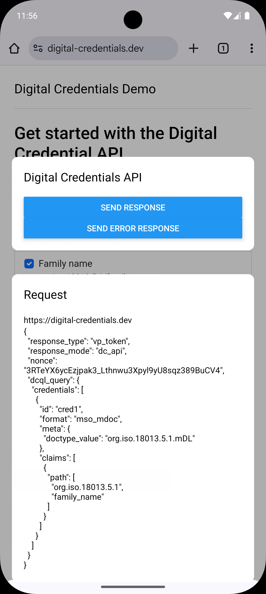

<p align="center">
  <picture>
   <source media="(prefers-color-scheme: light)" srcset="https://res.cloudinary.com/animo-solutions/image/upload/v1656578320/animo-logo-light-no-text_ok9auy.svg">
   <source media="(prefers-color-scheme: dark)" srcset="https://res.cloudinary.com/animo-solutions/image/upload/v1656578320/animo-logo-dark-no-text_fqqdq9.svg">
   
  </picture>
</p>

<h1 align="center" ><b>Expo - Digital Credentials API</b></h1>

<h4 align="center">Powered by &nbsp; 
  <picture>
    <source media="(prefers-color-scheme: light)" srcset="https://res.cloudinary.com/animo-solutions/image/upload/v1656579715/animo-logo-light-text_cma2yo.svg">
    <source media="(prefers-color-scheme: dark)" srcset="https://res.cloudinary.com/animo-solutions/image/upload/v1656579715/animo-logo-dark-text_uccvqa.svg">
    
  </picture>
</h4><br>

<p align="center">
  <a href="https://typescriptlang.org">
    
  </a>
  <a href="https://www.npmjs.com/package/@animo-id/expo-digital-credentials-api">
    
  </a>
  <a
    href="https://raw.githubusercontent.com/animo/expo-digital-credentials-api/main/LICENSE"
    ></a>
</p>

<p align="center">
  <a href="#getting-started">Getting started</a> 
  &nbsp;|&nbsp;
  <a href="#contributing">Contributing</a> 
  &nbsp;|&nbsp;
  <a href="#contributing">License</a> 
</p>

---

An [Expo Module](https://docs.expo.dev/modules/overview/) to automatically set up and configure [Digital Credentials API](https://digitalcredentials.dev) for Android in Expo apps.

- Currently a default matcher implementation for matching credentials based on a request is bundled, which only supports _mdoc_, _dc+sd-jwt_, _openid4vp_ , _dcql_ and _unsigned requests_. In the future support for a custom matcher might be added.
- During development when the activity is launched and the application is already running this results in render errors. In production these errors won't occur, but it does hinder the development experience. We're still looking for a solution.
- This library is tested with Expo 52 and React Native 0.76. It uses some hacks to use Kotlin 2.0.21, and is likely to break in non-default application setups. React Native 77 will use Kotlin 2 by default, and these hacks shouldn't be needed anymore.
- Icons provided for credentials are currently not rendered.

> [!NOTE]  
> This library integrates with experiments Android APIs, as well as draft versions of several specifications. Expect all APIs to break in future releases.

## Getting Started

Install the module using the following command.

```sh
# yarn
yarn add @animo-id/expo-digital-credentials-api

# npm
npm install @animo-id/expo-digital-credentials-api

# npm
pnpm install @animo-id/expo-digital-credentials-api
```

Then prebuild the application so the Expo Module wrapper can be added as native dependency (If you aren't making any manual modification to the Android directories you can add them to the gitignore of your project and generate them on demand):

```sh
# yarn
yarn expo prebuild

# npm
npx expo prebuild
```

That's it, you now have the Digital Credentials API configured for your Android project.

## Usage

You can now import `@animo-id/expo-digital-credentials-api` in your application.

### Registering Credentials

To make Android aware of the credentials availble in your wallet, you need to register the credentials. Every time the credentials in your application changes, you should call this method again.

```tsx
import {
  registerCredentials,
  RegisterCredentialsOptions,
} from "@animo-id/expo-digital-credentials-api";

// See RegisterCredentialsOptions for all options
await registerCredentials({
  credentials: [
    {
      id: "1",
      display: {
        title: "Drivers License",
        subtitle: "Issued by Utopia",
        claims: [
          {
            path: ["org.iso.18013.5.1", "family_name"],
            displayName: "Family Name",
          },
        ],
        iconDataUrl:
          "data:image/png;base64,iVBORw0KGgoAAAANSUhEUgAAAEAAAABACAIAAAAlC+aJAAAAaUlEQVR4nOzPUQkAIQDA0OMwpxksY19D+PEQ9hJsY6/5vezXAbca0BrQGtAa0BrQGtAa0BrQGtAa0BrQGtAa0BrQGtAa0BrQGtAa0BrQGtAa0BrQGtAa0BrQGtAa0BrQGtAa0E4AAAD//7vSAeZjAN7dAAAAAElFTkSuQmCC",
      },
      credential: {
        doctype: "org.iso.18013.5.1.mDL",
        format: "mso_mdoc",
        namespaces: {
          "org.iso.18013.5.1": {
            family_name: "Glastra",
          },
        },
      },
    },
    {
      id: "2",
      display: {
        title: "PID",
        subtitle: "Issued by Utopia",
        claims: [
          {
            path: ["first_name"],
            displayName: "First Name",
          },
          {
            path: ["address", "city"],
            displayName: "Resident City",
          },
        ],
        iconDataUrl:
          "data:image/png;base64,iVBORw0KGgoAAAANSUhEUgAAAEAAAABACAIAAAAlC+aJAAAAaUlEQVR4nOzPUQkAIQDA0OMwpxksY19D+PEQ9hJsY6/5vezXAbca0BrQGtAa0BrQGtAa0BrQGtAa0BrQGtAa0BrQGtAa0BrQGtAa0BrQGtAa0BrQGtAa0BrQGtAa0BrQGtAa0E4AAAD//7vSAeZjAN7dAAAAAElFTkSuQmCC",
      },
      credential: {
        vct: "eu.europa.ec.eudi.pid.1",
        format: "dc+sd-jwt",
        claims: {
          first_name: "Timo",
          address: {
            city: "Somewhere",
          },
        },
      },
    },
  ],
} satisfies RegisterCredentialsOptions);
```

### Handling Credential Request

When the user has selected a credential from your application, the application will be launched with an intent to retrieve the credentials. A custom component will be used and rendered as an overlay.



#### Registering the component

You should register the component as easrly as possible, usually in your `index.ts` file. If you're using Expo Router, [follow these steps](https://docs.expo.dev/router/installation/#custom-entry-point-to-initialize-and-load) to setup a custom entry point.

The component will be rendered in a full screen window, but with a transparent background. This allows you to render an overlay rather than a full screen application. By default all screen content that you do not render something over, has an `onPress` handler and will abort the request. You can disable this by passing

```tsx
import { registerRootComponent } from "expo";

import App from "./App";
import { MyCustomComponent } from "./MyCustomComponent";

// import the component registration method
// make sure to import this from the /register path
// so it doesn't load the native module yet
import registerGetCredentialComponent from "@animo-id/expo-digital-credentials-api/register";

// Registers the componetn to be used for sharing credentials
registerGetCredentialComponent(MyCustomComponent, {
  // Whether to cancel the request if the background is pressed. (where no content from your view is rendered).
  // Defaults to true
  cancelOnPressBackground: true,

  // Where to put the content if it doesn't fill the whole screen.
  // Options are 'bottom' (default), 'top', 'center'
  alignContent: "bottom",
});

// Default expo method call
registerRootComponent(App);
```

#### Handling the request

The request is passed to the registered component as `request` and has type `DigitalCredentialsRequest`.

```tsx
import {
  type DigitalCredentialsRequest,
  sendErrorResponse,
  sendResponse,
} from "@animo-id/expo-digital-credentials-api";
import { Button } from "react-native";
import { Text, View } from "react-native";

export function MyCustomComponent({
  request,
}: {
  request: DigitalCredentialsRequest;
}) {
  return (
    <View style={{ width: "100%" }}>
      <Button
        title="Send Response"
        onPress={() =>
          sendResponse({ response: JSON.stringify({ vp_token: "something" }) })
        }
      />
      <Button
        title="Send Error Response"
        onPress={() =>
          sendErrorResponse({ errorMessage: "Send error response" })
        }
      />
    </View>
  );
}
```

## Contributing

Is there something you'd like to fix or add? Great, we love community contributions! To get involved, please follow our [contribution guidelines](./CONTRIBUTING.md).

## License

Expo Digital Credentials Api is licensed under the [Apache 2.0](./LICENSE) license.
