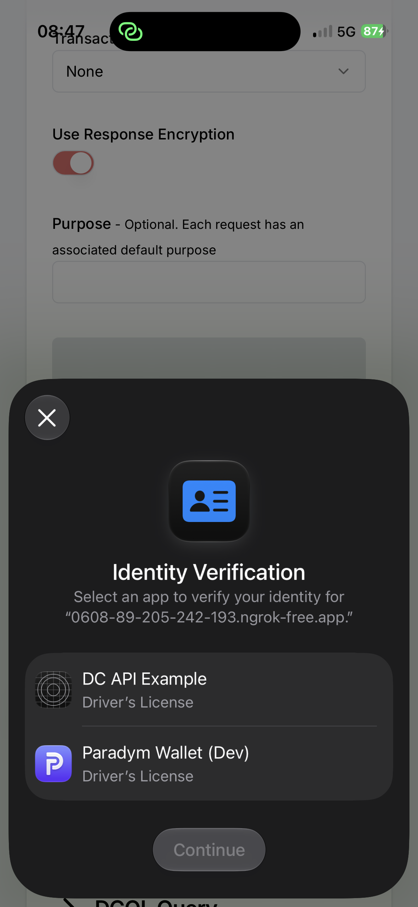
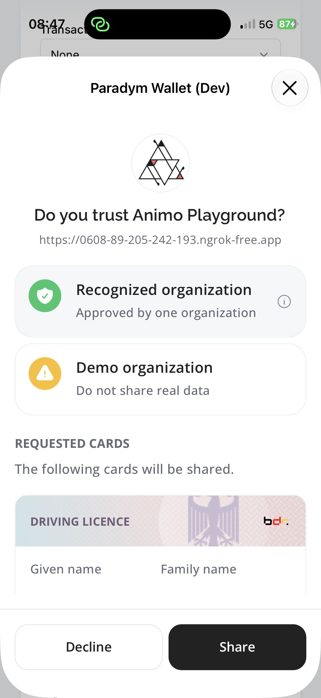
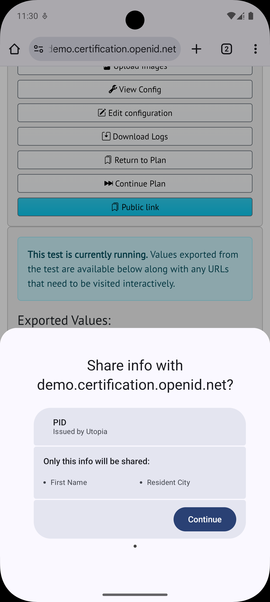

<p align="center">
  <picture>
   <source media="(prefers-color-scheme: light)" srcset="https://res.cloudinary.com/animo-solutions/image/upload/v1656578320/animo-logo-light-no-text_ok9auy.svg">
   <source media="(prefers-color-scheme: dark)" srcset="https://res.cloudinary.com/animo-solutions/image/upload/v1656578320/animo-logo-dark-no-text_fqqdq9.svg">
   
  </picture>
</p>

<h1 align="center" ><b>Expo - Digital Credentials API</b></h1>

<h4 align="center">Powered by &nbsp; 
  <picture>
    <source media="(prefers-color-scheme: light)" srcset="https://res.cloudinary.com/animo-solutions/image/upload/v1656579715/animo-logo-light-text_cma2yo.svg">
    <source media="(prefers-color-scheme: dark)" srcset="https://res.cloudinary.com/animo-solutions/image/upload/v1656579715/animo-logo-dark-text_uccvqa.svg">
    
  </picture>
</h4><br>

<p align="center">
  <a href="https://typescriptlang.org">
    
  </a>
  <a href="https://www.npmjs.com/package/@animo-id/expo-digital-credentials-api">
    
  </a>
  <a
    href="https://raw.githubusercontent.com/animo/expo-digital-credentials-api/main/LICENSE"
    ></a>
</p>

<p align="center">
  <a href="#getting-started">Getting Started</a> 
  &nbsp;|&nbsp;
  <a href="#usage">Usage</a> 
  &nbsp;|&nbsp;
  <a href="#contributing">Contributing</a> 
  &nbsp;|&nbsp;
  <a href="#contributing">License</a> 
</p>

---

An [Expo Module](https://docs.expo.dev/modules/overview/) to automatically set up and configure the [Digital Credentials API](https://digitalcredentials.dev) for Android and iOS in Expo apps.

This library is tested with **Expo 55** and **React Native 0.83**.

| | Android | iOS |
|---|---|---|
| Protocol `openid4vp` | ✅ | ❌ (not supported by the platform) |
| Protocol `org-iso-mdoc` (ISO/IEC TS 18013-7:2025 Annex C) | ✅ | ✅ |
| Protocol `openid4vp-v1-{unsigned,signed,multisigned}` | ✅  | ❌ |
| Minimum OS version | Credential Manager with registry support | iOS 26 |
| Credential matching | wasm matcher bundled with this library | performed by the OS |

Three wasm matchers are bundled for Android. Only Multipaz, the default, supports `org-iso-mdoc`.

<div align="center">
  <table>
    <tr>
      <th align="center" colspan="2">iOS</th>
      <th align="center" colspan="2">Android</th>
    </tr>
    <tr>
      <td></td>
      <td></td>
      <td></td>
      <td></td>
    </tr>
    <tr>
      <td align="center"><sub>Credential picker</sub></td>
      <td align="center"><sub>Request UI</sub></td>
      <td align="center"><sub>Credential picker</sub></td>
      <td align="center"><sub>Request UI</sub></td>
    </tr>
  </table>
</div>

## Getting started

```sh
npm install @animo-id/expo-digital-credentials-api   # or yarn add / pnpm add
```

Configure the plugin ([below](#configuration)), then `npx expo prebuild` so the native dependency is added.

### Configuration

Both platforms render the same React component from its own bundle, configured with a single config plugin. Add it to your app config:

```json
[
  "@animo-id/expo-digital-credentials-api",
  {
    "ios": {
      "documentTypes": ["org.iso.18013.5.1.mDL", "eu.europa.ec.eudi.pid.1"],
      "excludedPackages": ["react-native-maps"]
    }
  }
]
```

| Option | Default | Description |
|---|---|---|
| `entry` | `dc-api/index` | Bundle root of the request UI, relative to the project root and without extension. Metro resolves platform variants, so `dc-api/index.ios.tsx` works. |
| `ios.documentTypes` | — | Document types for the `…identity-document-services.document-provider.mobile-document-types` entitlement, from Apple's [allowed set](#supported-document-types). **The iOS extension is only generated when this is set.** |
| `ios.excludedPackages` | see below | React Native or Expo packages with native code to leave out of the extension's autolinking, by npm package name.|
| `ios.includedPackages` | — | The inverse: link only these React Native or Expo packages, leave out everything else. Setting both throws. |
| `ios.appGroup` | `group.<bundleId>` | App group shared by the app and the extension. This package stores nothing in it by default, but it provides a storage directory accessible by both the main application and the DC API app extension. See [Sharing storage with the request UI](#sharing-storage-with-the-request-ui). |
| `ios.keychainAccessGroup` | `<bundleId>` | Keychain access group shared by the app and the extension. The default is where keys are created by default if you haven't configured an access group, meaning no migration is needed. Using a custom value might require a migration/rotation of keys, if the keys are not already available in this access group.  |
| `ios.bundleIdSuffix` | `DocumentProvider` | Suffix appended to the app's bundle identifier for the extension. |
| `ios.deploymentTarget` | `26.0` | Deployment target of the extension. Must be at least iOS 26 (first iOS version DC API was added). The app's own is untouched, so it stays installable on older iOS. |
| `ios.fonts` | none | Fonts the request UI renders with, by file name as the app bundles them. See [Appearance](#appearance). |
| `ios.userInterfaceStyle` | the app's | Appearance the request UI renders in: `light`, `dark` or `automatic`. See [Appearance](#appearance) before pinning it, as there's some caveats. |
| `ios.backgroundColor` | system background | Background behind the request UI, `#RRGGBB` or `#RRGGBBAA`. Visible behind the sheet's title bar, before the JS renders, and wherever your screen is transparent, including insets you pad rather than paint. See [Appearance](#appearance). |

Every option except `entry` is iOS-only. Android needs no configuration, and applying the plugin with no options at all is valid.

#### Keeping it small

The request UI is bundled separately from the app. On iOS it runs in an app extension under a much
tighter memory budget, and everything the app links is linked into it by default. Trim it with
`ios.excludedPackages` (npm package names, applied to Expo modules and React Native autolinking
alike), or with `ios.includedPackages` once the list to leave out is longer than the list to keep:

```json
["@animo-id/expo-digital-credentials-api", {
  "ios": {
    "documentTypes": ["org.iso.18013.5.1.mDL"],
    "includedPackages": ["react-native-keychain", "react-native-safe-area-context"]
  }
}]
```

They fail in opposite directions, which is the thing to weigh: a package missing from
`excludedPackages` only makes the extension heavier, while one missing from `includedPackages` makes
it fail to link. Setting both throws.

`@animo-id/expo-digital-credentials-api`, `react-native`, `expo`, `expo-modules-core` and
`expo-asset` are always linked, the extension cannot start without them, and excluding one is
ignored with a warning. `expo-dev-client`, `expo-dev-launcher`, `expo-dev-menu`, `expo-router`,
`expo-splash-screen` and `expo-updates` are always excluded, since they drive the app's lifecycle or
use APIs extensions do not have.

Keep the imports under your entrypoint minimal. JS-only libraries count too, which often means
importing single components instead of whole barrels. **Never import an excluded package under your
entrypoint, it will fail at runtime.**

#### Appearance

iOS draws a sheet around the request UI, titled with the app's display name (`expo.name`). Android
hosts it in a transparent, untitled activity. Either way your screen paints what the user sees, so
give it a background. `ios.backgroundColor` pins the colour *behind* it, visible before the JS
renders, wherever your screen is transparent, and behind the sheet's title bar.

> **The sheet's title colour is the OS's, and follows the device.** iOS draws it in the device's
> appearance over a background you paint, and there are unfortunately no APIs to style it. So 
> `ios.userInterfaceStyle` only reaches this extension's own views. A light request UI on a dark
> device puts a white title on a light sheet, invisible. Either pick a `ios.backgroundColor` that
> both black and white text read against, or set `ios.userInterfaceStyle: 'automatic'`, leave
> `ios.backgroundColor` unset and theme your screen for both appearances.

`ios.userInterfaceStyle` defaults to your app's, so an app pinned to light gets a light request UI.

The room your screen gets differs per platform:

- **iOS** hands you the system sheet: already full height, already titled. Fill it (`flex: 1`).
  Rounding the top or capping the height puts a sheet inside a sheet. The top inset below the title
  bar is applied natively (`react-native-safe-area-context` cannot see OS chrome above the React
  Native view). The bottom edge is yours, so pad for the home indicator.
- **Android** gives you a transparent activity over the verifier's app, so your screen *is* the
  sheet: bottom aligned, rounding its own top, keeping its own height.

The app's fonts do not exist in the extension: `UIAppFonts` installs fonts for the bundle that
declares them, and the extension is a separate bundle. Name the ones the request UI draws with, by
file name as the app bundles them, and they are registered at launch from the app's bundle. They are
read in place, never copied, so nothing ships twice:

```json
["@animo-id/expo-digital-credentials-api", {
  "ios": { "documentTypes": ["org.iso.18013.5.1.mDL"], "fonts": ["OpenSans_400Regular.ttf"] }
}]
```

A font name the app does not bundle fails the prebuild. In your screen a `fontFamily` still names the
font's PostScript name (`OpenSans-Regular`), not the file.

#### Supported document types

iOS can only register the following document types:

- `org.iso.18013.5.1.mDL`
- `org.iso.23220.photoid.1`
- `org.iso.23220.1.jp.mnc`
- `eu.europa.ec.eudi.pid.1`
- `eu.europa.ec.av.1`

Everything else is filtered out before registration on iOS, so the same registration flow works on
both platforms. See [Apple Documentation](https://developer.apple.com/documentation/bundleresources/entitlements/com.apple.developer.identity-document-services.document-provider.mobile-document-types) for more information.

## Usage

### Registering credentials

Registration is what makes your wallet show up in the system credential picker. On Android, every call replaces
the whole set, so pass all credentials each time they change. On iOS you can also add and remove individual credential registrations.

Check `isSupported()` first, it is the only call that is always safe. Everything else throws
`DcApiUnsupportedError` on iOS below 26 and on Android without Credential Manager's registry API.

```ts
import {
  type DcApiCredential,
  getRegistrationStatus,
  isSupported,
  registerCredentials,
} from "@animo-id/expo-digital-credentials-api";

const credentials: DcApiCredential[] = [
  {
    id: "mdl",
    display: {
      title: "Drivers License",
      subtitle: "Issued by Utopia",
      claims: [{ path: ["org.iso.18013.5.1", "family_name"], displayName: "Family Name" }],
      // Optional, and shown in the picker: iconDataUrl: "data:image/png;base64,…"
    },
    credential: {
      format: "mso_mdoc",
      doctype: "org.iso.18013.5.1.mDL",
      namespaces: { "org.iso.18013.5.1": { family_name: "Glastra", age_over_18: true } },
    },
  },
  {
    id: "pid",
    display: {
      title: "PID",
      claims: [{ path: ["address", "city"], displayName: "Resident City" }],
    },
    credential: {
      format: "dc+sd-jwt",
      vct: "eu.europa.ec.eudi.pid.1",
      claims: { first_name: "Timo", address: { city: "Somewhere" } },
    },
  },
];

async function syncRegisteredCredentials() {
  if (!isSupported()) {
    console.log('DC API not supported');
    return
  }

  // iOS prompts on the first registerCredentials call; this reads where that stands without
  // prompting.
  const status = await getRegistrationStatus();
  if (status === "notAuthorized") return;

  const registered = await registerCredentials({
    credentials,
    android: { matcher: "multipaz" },
  });

  // ['mdl', 'pid'] on Android, ['mdl'] on iOS — the SD-JWT cannot be presented there.
  console.log(registered);
}
```

Credentials the platform cannot present are skipped rather than rejected, so you can pass the whole set
on both platforms. On iOS only `mso_mdoc` credentials with a document type in Apple's [allowed
set](#supported-document-types) register. The returned ids say which did.

**On iOS the credentials never leave your app.** Only the identifier, document type and the `ios`
gates are handed over, and nothing is kept. The registered ids are how you find your own credentials
again when a request comes in. Android needs a good deal more, because its matcher runs in a sandbox
with no access to your app. See [What each platform registers](#what-each-platform-registers).

iOS keeps the registered set itself, so a document can be added or dropped on its own:

```ts
// iOS only — on Android, call registerCredentials again with the new set.
await registerCredential({ credential: newlyIssuedMdl });
await removeCredential("mdl");
```

| Function | Platform | Description |
|---|---|---|
| `isSupported()` | both | Whether the API exists at all. Synchronous, and never throws. |
| `getRegistrationStatus()` | both | `'authorized' \| 'notAuthorized' \| 'notDetermined' \| 'notSupported'`. Reads the iOS permission without prompting. Always `'authorized'` on Android, which needs no permission. |
| `registerCredentials(options)` | both | Replaces the registered set. Returns the ids that registered. |
| `registerCredential(options)` | iOS | Adds one credential, leaving the rest of the registered set alone. Throws on Android, where the registry is replaced as a whole. |
| `removeCredential(id)` | iOS | Drops one credential. Throws on Android, so call `registerCredentials` with the remaining credentials instead. |
| `removeAllCredentials()` | both | Drops everything this package registered. |
| `getSharedContainerPath()` | iOS | Path of the app group container the app and the request UI share. Synchronous. See [Sharing storage with the request UI](#sharing-storage-with-the-request-ui). |

On Android you choose the matcher: the wasm module Credential Manager runs to match your credentials
against the request.

| Matcher | Protocols | Icons | Claim values |
|---|---|---|---|
| `multipaz` (default) | `openid4vp`, `openid4vp-v1-*`, `org-iso-mdoc` | ✅ | ✅ |
| `ubique` | `openid4vp` | ✅ | ✅ |
| `cmwallet` | `openid4vp` | ❌ | ❌ |

All three support SD-JWT VC and mdoc, signed and unsigned. Sources:
[multipaz](https://github.com/openwallet-foundation/multipaz/tree/main/multipaz-dcapi/src/androidMain/matcher) (Apache-2.0),
[oid4vp-wasm-matcher](https://github.com/UbiqueInnovation/oid4vp-wasm-matcher/releases/tag/v0.1.0),
[CMWallet](https://github.com/digitalcredentialsdev/CMWallet/blob/f4aa9ebbeaf55fa3973b467701887464be3d4b51/app/src/main/assets/openid4vp.wasm).

`android.protocols` defaults to everything the chosen matcher supports. Registering a protocol it
cannot answer throws. Each call clears the previous registry, so switching matcher or protocol never
leaves credentials showing twice.

#### What each platform registers

The two platforms match in different places, so they need different things from you.

On iOS the OS does the matching, and Apple's registration record has four fields: the document
identifier, the document type, the authority key identifiers from
`ios.supportedAuthorityKeyIdentifiers` and the `ios.invalidationDate`. That is all the OS gets. No
display metadata, no namespaces, no element identifiers and no claim values. The credentials stay in
your own storage, and this package keeps no copy of them.

Since the record holds no elements, iOS matches on the document type alone, after the reader trust
gate. A verifier asking for `family_name` on an mDL surfaces every registered mDL, including one that
does not carry that element. Working out what you can satisfy is the request UI's job. The
requested namespaces and elements arrive with the request, and you look up the credential behind the
identifier yourself. See [Handling the request](#handling-the-request).

On Android the matching runs in a wasm sandbox with no access to your app, so everything it needs has
to be handed over up front. `registerCredentials` encodes the display metadata (title, subtitle,
icon) and the claim values into the database Credential Manager stores and runs the matcher against.
The matcher can filter on individual claims, so a credential that is missing a requested claim never
reaches the picker.

|  | iOS | Android |
|---|---|---|
| Where matching happens | in the OS | in the wasm matcher, in a sandbox |
| What leaves the app | identifier, document type, trust gate, expiry | display metadata and claim values |
| Matched on | document type | individual claims |
| Formats | `mso_mdoc` with an [allowed document type](#supported-document-types) | anything the matcher supports |
| Registered set | added to and removed from per credential | replaced on every call |

So on iOS a request the user picked your wallet for can still be one you cannot answer. Handle that
in the request UI instead of assuming the OS filtered it out.

#### Trusting readers on iOS

`ios.supportedAuthorityKeyIdentifiers` is a trust gate the OS applies while matching, before the
wallet is involved. Each entry is the base64 encoding of one X.509 authority key identifier, belonging
to an authority you trust to sign requests.

| Value | Which requests reach the wallet |
|---|---|
| `[]` (the default) | Every request, signed or not. Trust decisions are yours to make in the request UI, from `readerAuthentications`. |
| Non-empty | Only requests whose reader authentication chains up to one of these authorities. Everything else, unsigned requests included, is never matched, and the user sees no entry for your wallet. |

The OS stores it with each document, so it is set on the credential:

```ts
await registerCredentials({
  credentials: [
    // Any reader may ask for this one.
    mdl,
    // This one only goes to readers the government signed for.
    { ...healthCard, ios: { supportedAuthorityKeyIdentifiers: ["Ej4mAJk…"] } },
  ],
});
```

Values that are not valid base64 throw.

Android has no equivalent, its matchers surface unsigned requests, and the wallet decides in the
request UI.

#### Expiring a registration on iOS

`ios.invalidationDate` is when the OS should stop matching a document. After that date the credential
is not matched against, without having to run to unregister anything.

```ts
await registerCredentials({
  credentials: [{ ...mdl, ios: { invalidationDate: new Date("2027-01-01T00:00:00Z") } }],
});
```

Leave it out for no expiry. A date in the past throws. Once it passes the OS stops matching silently,
so drop the credential from your own storage too. Android has no equivalent.

#### Sharing storage with the request UI

On iOS the request UI runs inside the provider extension, a separate process that cannot see the
app's container. Since iOS has no system picker, every wallet has to look credentials up while
answering a request, so the database belongs in the shared app group container.

The config plugin sets the app group up in both targets, and `getSharedContainerPath()` resolves it
in whichever process asks:

```ts
import { Platform } from "react-native";
import { getSharedContainerPath } from "@animo-id/expo-digital-credentials-api";

// The same path in the app and in the request UI, so both open the same file. Android's default
// location already works.
const directory = Platform.OS === "ios" ? getSharedContainerPath() : undefined;

// expo-sqlite takes it third, op-sqlite as `location` — check yours.
const db = await SQLite.openDatabaseAsync("wallet.db", {}, directory);
```

Moving an existing database there needs care:

- Treat it as a migration. A database in the app's documents directory is invisible to the
  extension, so copy the file plus its `-wal` and `-shm` siblings once.
- Two processes now share one file. Use WAL mode, keep the extension's writes short, and never hold
  a transaction open across the user's decision.
- The path changes across reinstalls, so store the file name rather than the absolute path.

`getSharedContainerPath()` throws on Android, where the request UI already shares the app's sandbox.

### Handling a credential request

Once the user picks a credential from your wallet, your own component is rendered as an overlay to
approve the request.


#### Registering the component

The request UI has one entry file for both platforms, `dc-api/index.tsx` by default. It is bundled on
its own, so it registers the component itself:

```tsx
// dc-api/index.tsx
import { registerDcApiScreen } from "@animo-id/expo-digital-credentials-api/request-handler";
import { MyCustomComponent } from "./MyCustomComponent";

export default registerDcApiScreen(MyCustomComponent);
```

Platform variants resolve as usual. Add `dc-api/index.ios.tsx` or `dc-api/index.android.tsx` for a
different component per platform, or point the plugin's `entry` option elsewhere.

Keep the app's own entry (`index.ts`, or the Expo Router root) out of this file: it runs in the
provider extension on iOS and in the picker's activity on Android, neither of which loads the app
bundle.

#### Handling the request

The registered component gets `request: DcApiRequest`, a union on `platform`, since the platforms
know different things at this point:

- **Android** delivers the protocol requests with the picker result, along with the credential the
  user chose. Nothing is parsed for you: read the OpenID4VP request or Annex C `deviceRequest` with
  whatever stack you already use.
- **iOS** has no picker and holds the raw request back until you commit. Up front you get the request
  *as the OS parsed it* (which documents, which elements), and render consent and credential
  selection from that. `approve()` then releases the real thing, always Annex C.

```ts
type DcApiRequest =
  | {
      platform: "android";
      origin: string | undefined;
      callingPackage: string;
      requests: DcApiProtocolRequest[];
      selectedCredentialId: string;
      selectedRequestIndex: number;
      respond(options: DcApiResponseOptions): Promise<void>;
      decline(reason?: string): void;
    }
  | {
      platform: "ios";
      origin: string;
      presentmentRequests: IosPresentmentRequest[];
      readerAuthentications: { certificateChain: string[] }[];
      approve(): Promise<IsoMdocProtocolRequest[]>;
      respond(options: IsoMdocResponseOptions): Promise<void>;
      decline(reason?: string): void;
    };
```

| Prop | Platform | Description |
|---|---|---|
| `origin` | both | WHATWG ASCII serialization of the requesting website origin, always from the OS. On Android it is `undefined` when a native app asked for itself. See [below](#when-there-is-no-origin). |
| `callingPackage` | Android | The package that made the request, e.g. `com.android.chrome`. |
| `requests` | Android | The [protocol requests](#protocol-requests) the verifier sent, in its order. Protocols this package does not know are left out, so this can be empty. |
| `selectedCredentialId` | Android | The credential the user picked in the system picker, as passed to `registerCredentials`. |
| `selectedRequestIndex` | Android | Index into `requests` for the entry the picked credential was matched against. See [the caveat](#the-picked-entry). |
| `presentmentRequests` | iOS | [What the OS parsed](#the-parsed-request-ios) out of the request: documents, elements, and their `intentToRetain`. |
| `readerAuthentications` | iOS | The reader authentications the request carried, each with its certificate chain as base64 DER. Empty when the request was not signed. |

| Method | Platform | Behaviour |
|---|---|---|
| `approve()` | iOS | Commits to answering, and resolves with the protocol request the OS then releases. Always exactly one `org-iso-mdoc` request, in the same shape Android's `requests` has. Call it after the user approved. On iOS this is the point of no return. |
| `respond({ protocol, data })` | both | Completes the request. See [responding](#responding). |
| `decline(reason?)` | both | Declines. The reason is for logs, and the OS decides what the verifier sees. |

##### Protocol requests

Both platforms describe a request the same way. Android's `request.requests` and what iOS's
`approve()` resolves with are the same `DcApiProtocolRequest[]`.

```ts
type DcApiProtocolRequest =
  // openid4vp | openid4vp-v1-unsigned | openid4vp-v1-signed | openid4vp-v1-multisigned
  | { protocol: Openid4vpProtocol; data: string }
  | { protocol: "org-iso-mdoc"; data: { deviceRequest: string; encryptionInfo: string } };
```

| Protocol | `data` | Platform |
|---|---|---|
| `openid4vp` | The OpenID4VP authorization request, as a JSON string. The draft protocol identifier. | Android |
| `openid4vp-v1-unsigned` | Same, for an unsigned OpenID4VP 1.0 request. | Android |
| `openid4vp-v1-signed` | Same, for a signed request. Verify the signature before trusting anything in it. | Android |
| `openid4vp-v1-multisigned` | Same, for a request carrying more than one signature. | Android |
| `org-iso-mdoc` | ISO/IEC TS 18013-7:2025 C.2: `deviceRequest` and `encryptionInfo`, both base64url-no-pad encoded CBOR. | both |

Chrome is inconsistent about whether `data` arrives as a string or an object. Android normalizes it
to the table above before it reaches JS. `org-iso-mdoc` is the only protocol iOS speaks.

##### The picked entry

`selectedRequestIndex` comes from the wasm matcher, and is mapped back onto `requests` after dropping
unknown protocols, so it is always a valid index. It is only as good as the matcher's answer though,
falling back to `0` when it cannot be mapped. If you answer more than one protocol, pick from `requests`
yourself:

```ts
// e.g. prefer OpenID4VP when the verifier offered it, whatever the picker matched
const openid4vp = request.requests.find((r) => r.protocol !== "org-iso-mdoc");
```

##### The parsed request (iOS)

`presentmentRequests` mirrors `ISO18013MobileDocumentRequest.presentmentRequests` one to one:

```ts
type IosPresentmentRequest = {
  // PresentmentRequest.isMandatory
  isMandatory: boolean;
  documentRequestSets: {
    // DocumentRequestSet.requests
    documentRequests: {
      // DocumentRequest.documentType
      doctype: string;
      // DocumentRequest.namespaces, with ElementInfo.isRetaining as intentToRetain
      namespaces: Record<string, Record<string, { intentToRetain: boolean }>>;
    }[];
  }[];
};
```

```ts
// A request for the family name and portrait from an mDL:
[
  {
    isMandatory: true,
    documentRequestSets: [
      {
        documentRequests: [
          {
            doctype: "org.iso.18013.5.1.mDL",
            namespaces: {
              "org.iso.18013.5.1": {
                family_name: { intentToRetain: false },
                portrait: { intentToRetain: true },
              },
            },
          },
        ],
      },
    ],
  },
];
```

`intentToRetain` is the verifier's claim about whether it will store an element rather than only check
it. Show it in your consent screen, but nothing enforces it.

The nesting carries the verifier's logic, and the wallet has to honour it:

- **`presentmentRequests`**: every request marked `isMandatory` must be answered, the others may be
  left out.
- **`documentRequestSets`**: *exactly one* set answers a presentment request. The sets are
  alternatives, and choosing between them is the only structural choice you have.
- **`documentRequests`**: *every* document in the chosen set must be answered, so one response can
  carry several.

Match this against your own credential storage to find which credentials can answer. The library
keeps no copy, see [Sharing storage with the request UI](#sharing-storage-with-the-request-ui).
[`example/dc-api/DcApiScreen.tsx`](example/dc-api/DcApiScreen.tsx) walks the whole structure.

Android has no equivalent and needs none: `request.requests` is the real request from the start.

##### Responding

`respond()` takes the protocol you answered and that protocol's data object.

It uses the shape the Digital Credentials API itself uses: a `protocol` and its `data`.

```ts
type DcApiResponseOptions =
  | { protocol: Openid4vpProtocol; data: Record<string, unknown> }
  | { protocol: "org-iso-mdoc"; data: { response: string } };
```

| Protocol | `data` |
|---|---|
| `openid4vp*` | The OpenID4VP authorization response. What goes in it is OpenID4VP's business: `{ vp_token: … }`, or `{ response: "<JWE>" }` when the request asked for encryption. |
| `org-iso-mdoc` | The ISO/IEC TS 18013-7:2025 C.3 response: `{ response: "<base64url-no-pad EncryptedResponse>" }`. |

The types enforce which protocols you can answer: Android's `respond` takes either variant, iOS's only
`org-iso-mdoc`, so an un-narrowed `DcApiRequest` does too. Narrow on `platform` before answering
OpenID4VP.

##### Putting it together

Answering both protocols, on both platforms.

```tsx
import type { DcApiRequest } from "@animo-id/expo-digital-credentials-api/request-handler";
import { Button, View } from "react-native";

export function MyCustomComponent({ request }: { request: DcApiRequest }) {
  const onShare = async () => {
    if (request.platform === "android") {
      // The picker delivered the request and matched an entry against it.
      const picked = request.requests[request.selectedRequestIndex];
      if (!picked) return request.decline("no protocol this wallet can answer");

      if (picked.protocol !== "org-iso-mdoc") {
        // An OpenID4VP authorization request, as a JSON string. Signed variants are a JWT —
        // verify them before rendering or answering anything they contain.
        const authorizationResponse = await buildOpenid4vpResponse(picked.data, request.origin);
        return request.respond({ protocol: picked.protocol, data: authorizationResponse });
      }

      return request.respond({
        protocol: "org-iso-mdoc",
        data: { response: await buildAnnexCResponse(picked.data, request.origin) },
      });
    }

    // iOS releases the request only once the wallet commits to answering it, so this belongs
    // behind the user's approval — and what comes back is always Annex C.
    const [isoMdoc] = await request.approve();
    if (!isoMdoc) return request.decline("no protocol this wallet can answer");

    return request.respond({
      protocol: "org-iso-mdoc",
      data: { response: await buildAnnexCResponse(isoMdoc.data, request.origin) },
    });
  };

  return (
    <View style={{ width: "100%" }}>
      <Button title="Share" onPress={onShare} />
      <Button title="Decline" onPress={() => request.decline()} />
    </View>
  );
}
```

`buildAnnexCResponse` is the same function in both branches, since `{ deviceRequest, encryptionInfo }`
is the same shape wherever it came from. With Credo it is `agent.mdoc.resolveDcApiRequest` followed by
`agent.mdoc.createDcApiResponse`. The [example app](./example/dc-api/DcApiScreen.tsx) shows the whole
screen.

> [!IMPORTANT]
> Always use the `origin` the OS provides, never one taken from the request payload. It is bound into the session transcript, which is what makes a response relayed from another origin undecryptable.

##### When there is no origin

On Android `origin` is `undefined` when a native app called Credential Manager for itself rather than
a browser on behalf of a page. Use `callingPackage` instead: decline, or derive the app-based origin
your protocol prescribes from it.

An unverifiable origin never reaches you: a caller claiming an origin without being a privileged app
fails natively. On iOS `origin` is always a string, and requests without one are cancelled before
your UI is shown.

## Known issues

Two upstream bugs affect the request UI. Both are fixed by patches in [`patches/`](./patches). Copy
the file into your project and apply it with pnpm's `patchedDependencies`, or with
[`patch-package`](https://github.com/ds300/patch-package), which matches on the file name.

### Text with a `fontFamily` is invisible on iOS

React Native reads the user's text size from `UIApplication`, which an app extension does not have,
so its font size multiplier is `0` and every font is sized to nothing. The system font falls back to
its default size, so *only* text naming a `fontFamily` disappears, which looks like a font problem
and is not one ([facebook/react-native#54642](https://github.com/facebook/react-native/issues/54642)).

[`react-native+0.85.3.patch`](./patches/react-native+0.85.3.patch) reads the text size from the
current trait collection instead, which an extension does get from its host, and clamps anything
unusable to `1.0`. It patches React Core sources, so React Native has to be built from source too.
Against the prebuilt `React.xcframework` it is never compiled:

```json
["expo-build-properties", { "ios": { "buildReactNativeFromSource": true } }]
```

### Keychain reads fail in the request UI on Android

Reads fail with `There are multiple DataStores active for the same file` while the same call works
in the app. Android runs the request UI on a second React host in the app's process, so every
autolinked module is instantiated twice. Since 9.2.0 `react-native-keychain` builds its `DataStore`
per instance, so the second host opens a second store over the same file. Your storage layer usually
wraps this in an error of its own, so read the real cause from `adb logcat`.

[`react-native-keychain+10.0.0.patch`](./patches/react-native-keychain+10.0.0.patch) moves the store
to file level with a process-owned scope. Upstream:
[#777](https://github.com/oblador/react-native-keychain/issues/777),
[#784](https://github.com/oblador/react-native-keychain/issues/784),
[#801](https://github.com/oblador/react-native-keychain/issues/801). The open fix in
[#793](https://github.com/oblador/react-native-keychain/pull/793) keeps the module-owned scope, so
the first module invalidated still takes the shared store down. Unreleased since 10.0.0.

iOS needs no patch: separate process, keychain items reached through `ios.keychainAccessGroup`.
Link the package into the extension either way.

> [!NOTE]
> Nothing here is specific to `react-native-keychain`. Any native module holding a process-wide
> resource keyed by file or name breaks the same way on Android: it works in the app and fails only
> in the request UI.

## Contributing

Is there something you'd like to fix or add? Great, we love community contributions! To get involved, please follow our [contribution guidelines](https://github.com/animo/.github/blob/main/CONTRIBUTING.md).

## License

This repository is licensed under the [Apache 2.0](./LICENSE) license.
