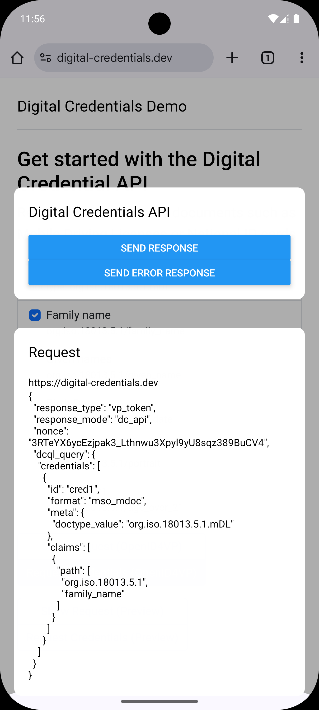

<p align="center">
  <picture>
   <source media="(prefers-color-scheme: light)" srcset="https://res.cloudinary.com/animo-solutions/image/upload/v1656578320/animo-logo-light-no-text_ok9auy.svg">
   <source media="(prefers-color-scheme: dark)" srcset="https://res.cloudinary.com/animo-solutions/image/upload/v1656578320/animo-logo-dark-no-text_fqqdq9.svg">
   
  </picture>
</p>

<h1 align="center" ><b>Expo - Digital Credentials API</b></h1>

<h4 align="center">Powered by &nbsp; 
  <picture>
    <source media="(prefers-color-scheme: light)" srcset="https://res.cloudinary.com/animo-solutions/image/upload/v1656579715/animo-logo-light-text_cma2yo.svg">
    <source media="(prefers-color-scheme: dark)" srcset="https://res.cloudinary.com/animo-solutions/image/upload/v1656579715/animo-logo-dark-text_uccvqa.svg">
    
  </picture>
</h4><br>

<p align="center">
  <a href="https://typescriptlang.org">
    
  </a>
  <a href="https://www.npmjs.com/package/@animo-id/expo-digital-credentials-api">
    
  </a>
  <a
    href="https://raw.githubusercontent.com/animo/expo-digital-credentials-api/main/LICENSE"
    ></a>
</p>

<p align="center">
  <a href="#minimal-getting-started">Getting Started</a> 
  &nbsp;|&nbsp;
  <a href="#usage">Usage</a> 
  &nbsp;|&nbsp;
  <a href="#contributing">Contributing</a> 
  &nbsp;|&nbsp;
  <a href="#contributing">License</a> 
</p>

---

An [Expo Module](https://docs.expo.dev/modules/overview/) to automatically set up and configure [Digital Credentials API](https://digitalcredentials.dev) for Android in Expo apps.

- Matcher WASM binaries are shipped inside the matcher wrapper packages and loaded at runtime; the base package only accepts raw matcher bytes.
- During development when the activity is launched and the application is already running this results in render errors. In production these errors won't occur, but it does hinder the development experience. We're still looking for a solution.
- This library is tested with Expo 52 and React Native 0.76. It uses some hacks to use Kotlin 2.0.21, and is likely to break in non-default application setups. React Native 77 will use Kotlin 2 by default, and these hacks shouldn't be needed anymore.
- When using the CMWallet matcher, icons provided for credentials are not rendered.

> [!NOTE]  
> This library integrates with experimental Android APIs, as well as draft versions of several specifications. Expect all APIs to break in future releases.

<p align="center">
  
  
</p>

## Matcher Packages

| Package | Purpose |
| --- | --- |
| `@animo-id/expo-digital-credentials-api-cmwallet` | Matcher wrapper for the CMWallet registry format |
| `@animo-id/expo-digital-credentials-api-ubique` | Matcher wrapper for the Ubique registry format |
| `@animo-id/expo-digital-credentials-api-aptitude-consortium` | Matcher wrapper for the Aptitude Consortium registry format |
| `@animo-id/expo-digital-credentials-api-cmwallet-issuance` | OpenID4VCI creation options wrapper |

## Minimal Getting Started

This is the smallest working setup: install, prebuild, register an overlay component, and register matcher bytes.

Install the module using the following command.

```sh
# yarn
yarn add @animo-id/expo-digital-credentials-api

# npm
npm install @animo-id/expo-digital-credentials-api

# npm
pnpm install @animo-id/expo-digital-credentials-api
```

Install a matcher wrapper package from the table above. If you need OpenID4VCI issuance, install the creation options wrapper.

```sh
pnpm install <matcher-wrapper-package>
pnpm install <issuance-wrapper-package>
```

Then prebuild the application so the Expo Module wrapper can be added as native dependency (If you aren't making any manual modification to the Android directories you can add them to the gitignore of your project and generate them on demand):

```sh
# yarn
yarn expo prebuild

# npm
npx expo prebuild
```

Register the overlay component early (usually in `index.ts`):

```ts
import { registerRootComponent } from "expo";
import registerGetCredentialComponent, {
  registerCreateCredentialComponent,
} from "@animo-id/expo-digital-credentials-api/register";
import App from "./App";
import GetOverlay from "./GetOverlay";
import CreateOverlay from "./CreateOverlay";

registerGetCredentialComponent(GetOverlay);
registerCreateCredentialComponent(CreateOverlay);
registerRootComponent(App);
```

Register credentials (example for CMWallet):

```ts
import { registerCredentials } from "@animo-id/expo-digital-credentials-api-cmwallet";

await registerCredentials({ credentials });
```

That's it. Your app can now receive Digital Credentials API intents.

> [!WARNING]  
> You might need to set the Kotlin version of your project to 2.0.21. To do this, add the [`expo-build-properties`](https://docs.expo.dev/versions/latest/sdk/build-properties/) dependency to your project, and configure it with `android.kotlinVersion` set to `'2.0.21'`.
>
> ```json
> [
>   "expo-build-properties",
>   {
>     "android": {
>       "kotlinVersion": "2.0.21"
>     }
>   }
> ]
> ```

## Usage

This section dives into each feature in detail.

The base package (`@animo-id/expo-digital-credentials-api`) exposes low-level APIs that accept raw bytes and matcher WASM bytes. For object-based configuration (including runtime loading of matcher WASM), use the matcher packages listed in the table above.

If you call the base API directly, you must supply `matcherBytes` as a `Uint8Array`. The matcher packages expose `loadMatcherBytes()` helpers to load the bundled WASM at runtime.

If you use a custom Metro config, ensure `wasm` is included in `resolver.assetExts` so the bundled matcher assets are packaged correctly.

### Allowed Apps (Origin Verification)

The native module uses a JSON allowlist to map calling app signatures to verified origins. By default it uses the bundled `allowedApps.json`, but you can override it at runtime:

```ts
import { setAllowedApps } from "@animo-id/expo-digital-credentials-api";

setAllowedApps({
  allowedAppsJson: JSON.stringify({
    apps: [
      {
        type: "android",
        info: {
          package_name: "com.example.browser",
          signatures: [
            {
              build: "release",
              cert_fingerprint_sha256: "AA:BB:CC:...",
            },
          ],
        },
      },
    ],
  }),
});
```

Pass `null` or an empty string to clear the override and fall back to the bundled list.

### Registering Credentials

To make Android aware of the credentials available in your wallet, you need to register the credentials. Every time the credentials in your application changes, you should call this method again.

Choose the matcher package that fits your needs. Registering credentials for a matcher overrides the previous registration for that matcher. The supported matchers are:

- CMWallet matcher taken from https://github.com/digitalcredentialsdev/CMWallet. ([current version](https://github.com/digitalcredentialsdev/CMWallet/blob/f4aa9ebbeaf55fa3973b467701887464be3d4b51/app/src/main/assets/openid4vp.wasm))
  - Supports SD-JWT VC and mDOC
  - Supports signed requests
  - Does not support icons
  - Does not support showing claim values
- Ubique matcher taken from https://github.com/UbiqueInnovkation/oid4vp-wasm-matcher. ([current version](https://github.com/UbiqueInnovation/oid4vp-wasm-matcher/releases/tag/v0.1.0)).
  - Supports SD-JWT VC and mDOC
  - Supports signed requests
  - Supports icons
  - Supports showing claim values

The matcher packages accept unencoded objects in `registerCredentials`. If you need the raw bytes (e.g., to call the base API), use `encodeCredentials` from the matcher package.

```tsx
import { registerCredentials } from "@animo-id/expo-digital-credentials-api-cmwallet";

await registerCredentials({ credentials });
```

### Registering Creation Options (OpenID4VCI)

To allow OpenID4VCI issuance, register creation options with the CMWallet issuance matcher:

```tsx
import { encodeIssuanceCreationOptions, registerCreationOptions } from "@animo-id/expo-digital-credentials-api-cmwallet-issuance";

// Build creationOptions bytes from the matcher schema
const creationOptions = encodeIssuanceCreationOptions({
  display: {
    title: "My Wallet",
    subtitle: "Save your document",
    iconDataUrl: "data:image/png;base64,...",
  },
  issuerAllowlist: ["https://issuer.example"],
});
await registerCreationOptions({
  creationOptions,
});
```

### Request Payloads

#### Get Credential Request (JS)

```ts
type DigitalCredentialsRequest = {
  // Normalized request JSON extracted from the Android bundle
  request?: {
    requests?: Array<{ protocol: string; data: unknown }>
    providers?: Array<{ protocol: string; request: string }>
  }

  // Convenience fields when available
  origin?: string | null
  packageName?: string
  signingInfo?: string

  // Normalized credential option entries (Android)
  credentialOptions?: Array<{
    type?: string
    allowedProviders?: unknown
    isSystemProviderRequired?: boolean
    candidateQueryData?: Record<string, unknown>
    retrievalData?: Record<string, unknown>
  }>

  // Optional matcher selection metadata
  selectedEntry?: { providerIndex: number; credentialId: string }
  selection?: {
    requestIdx: number
    creds: Array<{
      entryId: string
      matchedClaimPaths?: Array<Array<string | number | null>>
      metadata?: Record<string, unknown>
    }>
  }

  // Raw ProviderGetCredentialRequest bundle JSON (Android), for debugging
  sourceBundle?: unknown

  // Additional raw keys if present
  [key: string]: unknown
}
```

Notes:
- `request`, `origin`, and `packageName` are derived from the Android bundle when possible.
- `sourceBundle` keeps the full raw bundle for debugging or custom parsing.

#### Create Credential Request (JS)

```ts
type DigitalCredentialsCreateRequest = {
  origin: string | null
  packageName: string
  type: string
  // Raw request JSON from the system, if provided
  request: object | null
}
```

### Handling Credential Request

When the user has selected a credential from your application, the application will be launched with an intent to retrieve the credentials. A custom component will be used and rendered as an overlay.


#### Registering the component

You should register the component as early as possible, usually in your `index.ts` file. If you're using Expo Router, [follow these steps](https://docs.expo.dev/router/installation/#custom-entry-point-to-initialize-and-load) to setup a custom entry point.

The component will be rendered in a full screen window, but with a transparent background. This allows you to render an overlay rather than a full screen application. By default all screen content that you do not render something over, has an `onPress` handler and will abort the request. You can disable this by setting `cancelOnPressBackground` to `false`.

```tsx
import { registerRootComponent } from "expo";

import App from "./App";
import { MyCustomComponent } from "./MyCustomComponent";

// import the component registration method
// make sure to import this from the /register path
// so it doesn't load the native module yet, as that will prevent the app from correctly loading
import registerGetCredentialComponent, {
  registerCreateCredentialComponent,
} from "@animo-id/expo-digital-credentials-api/register";

// Registers the componetn to be used for sharing credentials
registerGetCredentialComponent(MyCustomComponent);
registerCreateCredentialComponent(MyCreateComponent);

// Default expo method call
registerRootComponent(App);
```

#### Handling the request

The request is passed to the registered component as `request` and has type `DigitalCredentialsRequest`.

```tsx
import {
  type DigitalCredentialsRequest,
  sendErrorResponse,
  sendResponse,
} from "@animo-id/expo-digital-credentials-api";
import { Button } from "react-native";
import { Text, View } from "react-native";

export function MyCustomComponent({
  request,
}: {
  request: DigitalCredentialsRequest;
}) {
  return (
    <View style={{ width: "100%" }}>
      <Button
        title="Send Response"
        onPress={() =>
          sendResponse({ response: JSON.stringify({ vp_token: "something" }) })
        }
      />
      <Button
        title="Send Error Response"
        onPress={() =>
          sendErrorResponse({ errorMessage: "Send error response" })
        }
      />
    </View>
  );
}
```

#### Handling Create Credential Request (OpenID4VCI)

The create-credential request is passed to the registered component as `request` with type `DigitalCredentialsCreateRequest`:

```tsx
import {
  type DigitalCredentialsCreateRequest,
  sendCreateErrorResponse,
  sendCreateResponse,
} from "@animo-id/expo-digital-credentials-api";

export function MyCreateComponent({
  request,
}: {
  request: DigitalCredentialsCreateRequest;
}) {
  return (
    <View style={{ width: "100%" }}>
      <Button
        title="Send Create Response"
        onPress={() =>
          sendCreateResponse({
            response: JSON.stringify({ protocol: "openid4vci", data: {} }),
          })
        }
      />
      <Button
        title="Send Create Error Response"
        onPress={() =>
          sendCreateErrorResponse({ errorMessage: "Send error response" })
        }
      />
    </View>
  );
}
```

#### Note on Expo Router

If you're using Expo Router, the root application is automatically loaded and executed, even if a custom activity is launched in React Native, and thus your main application logic will be executed (although not visible).

To prevent this from happening, you can create a small wrapper that returns `null` when the current activity is the get credential activity using the `isGetCredentialActivity` method. Make sure to only call this method once your app component is loaded, to prevent the app loading to get stuck.

```ts
import { isGetCredentialActivity } from "@animo-id/expo-digital-credentials-api";

export default function App() {
  const isDcApi = useMemo(() => isGetCredentialActivity(), []);
  if (isDcApi) return null;

  return <MainApp />;
}
```

## Contributing

Is there something you'd like to fix or add? Great, we love community contributions! To get involved, please follow our [contribution guidelines](https://github.com/animo/.github/blob/main/CONTRIBUTING.md).

## License

This repository is licensed under the [Apache 2.0](./LICENSE) license.
